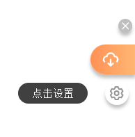
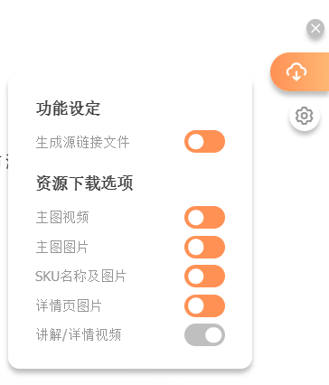
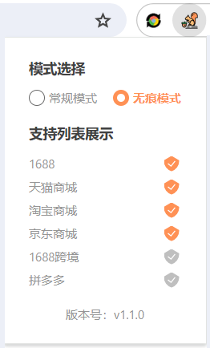
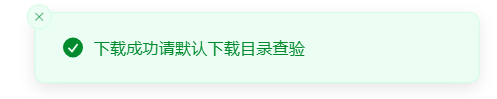
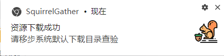

# SquirrelGather

A browser plugin that automatically downloads **main images**, **main videos**, **SKU images and names**, **product titles**, **detail page images**, and **product demo videos** from **1688**, **Tmall**, **Taobao**, and **JD.com**.

---

<p align="center">
<strong>Download button hover</strong><br/>
<br/><br/>
<strong>Close button hover</strong><br/>
<br/><br/>
<strong>Settings button hover</strong><br/>
<br/><br/>
<strong>Click settings button</strong><br/>
<br/><br/>
<strong>Click popup</strong><br/>
<br/><br/>
<strong>Page inside sonner</strong><br/>
<br/><br/>
<strong>System notifications</strong><br/>
<br/><br/>
</p>

---

## 🚀 Features

- 🔄 Hot Reload Support
- 🌐 Compatible with Chrome / Edge / Firefox
- 🕵️ Regular Mode & Incognito Mode
- 🔔 System Notifications
- 🎛️ Draggable Custom UI

---

## 🧪 Development

Install dependencies and run in dev mode:

```bash
pnpm install
pnpm dev
```

---

## 📦 Build

To build the extension for production:

```bash
pnpm build
```

---

## 🌍 Extension Installation

- Build the project using the command above.

- Open your browser and go to the extensions page:

  - Chrome: chrome://extensions/

  - Edge: edge://extensions/

- Enable Developer Mode.

- Click Load unpacked and select the extension folder inside the project.

---

## 🧱 Built With

This project is scaffolded with:
👉 [vitesse-webext](https://github.com/antfu-collective/vitesse-webext)

---

## 📄 License

[MIT](LICENSE)+多行善事
